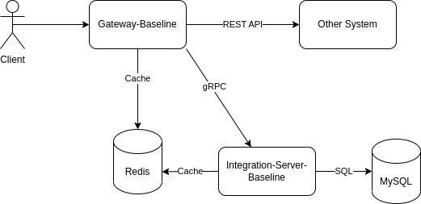

# Microservice-gRPC-Java

This project was created as a baseline development for microservice with gRPC

## How To Run

1. Run docker compose with command `docker compose up`
2. Run application with command `mvn clean spring-boot:run`

## How To Build

1. Run build jar with command `mvn clean install`
2. Run build docker image with command `mvn clean install docker:build`

## Architecture

